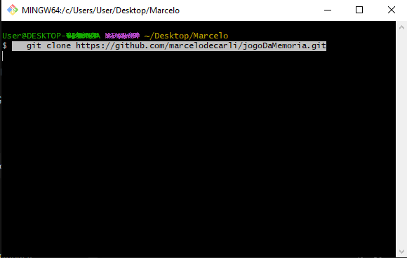
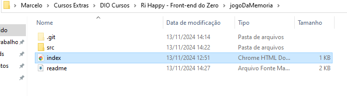
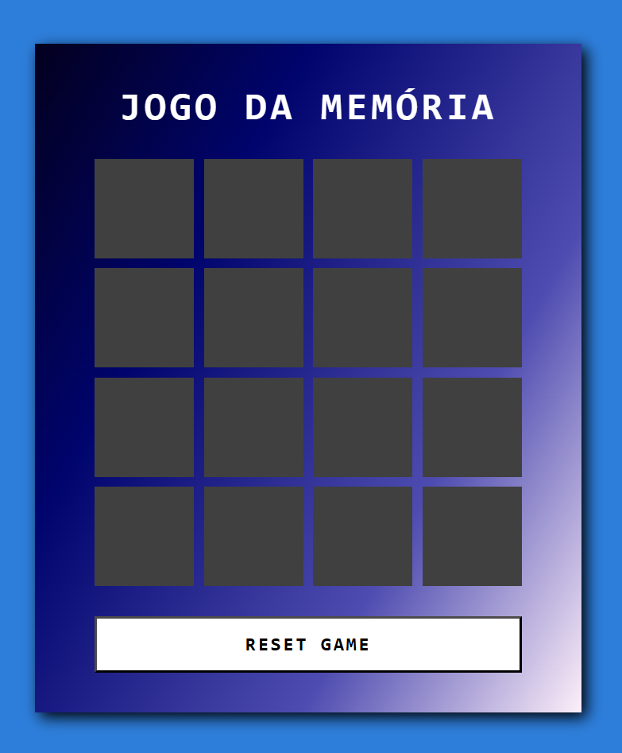

# Jogo da Memória

Um jogo simples de memória desenvolvido em HTML, CSS e JavaScript.

## Sobre o Jogo

O objetivo é encontrar todos os pares de cartas no menor tempo possível. Teste sua memória e desafie a si mesmo!

## Funcionalidades

- Interface interativa e responsiva
- Temporizador para medir o tempo de jogo
- Exibição de pares encontrados e tentativas

## Tecnologias Utilizadas

- HTML5
- CSS3
- JavaScript

## Como Jogar

1. **Clone o repositório:**  
   Execute o seguinte comando no terminal para clonar o repositório localmente, eu utilizo o Git como está na imagem de exemplo:
   ```
   git clone https://github.com/marcelodecarli/jogoDaMemoria.git
   ```

<div style="display: flex; justify-content: center;"></div>

--- 

2. **Abra o arquivo `index.html`:**
Localize o arquivo index.html no diretório (pasta) que recém foi clonada e abra-o no seu navegador. Esse arquivo inicia o jogo e carrega todos os recursos necessários, exemplo na imagem: (Estará na pasta raiz)

<div style="display: flex; justify-content: center;"></div>

---

3. **Instruções para Jogar:**  

   - Clique em uma carta para revelá-la.
   - Memorize a posição das cartas e tente encontrar o par correspondente.
   - Continue até encontrar todos os pares no menor tempo possível.
---

Por fim aqui temos a interface.

<div style="display: flex; justify-content: center;"></div>


